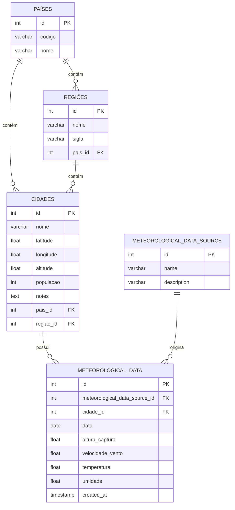

## Estrutura do Banco de Dados

### Tabelas

```sql
Table paises {
  id integer [primary key]
  codigo varchar [not null, unique]
  nome varchar [not null, unique]
}

Table regioes {
  id integer [primary key]
  nome varchar [not null]
  sigla varchar [not null]
  pais_id integer [not null]
}

Table cidades {
  id integer [primary key]
  nome varchar [not null]
  latitude float [not null]
  longitude float [not null]
  altitude float
  populacao integer
  notes text [note: 'Informações adicionais sobre a cidade']
  pais_id integer [not null]
  regiao_id integer [not null]
}

Table meteorological_data_source {
  id integer [primary key, increment]
  name varchar [not null, unique]
  description varchar
}

Table meteorological_data {
  id integer [primary key]
  meteorological_data_source_id integer [not null]
  cidade_id integer [not null]
  data date [not null]
  altura_captura float 
  velocidade_vento float
  temperatura float
  umidade float
  created_at timestamp
}
```

### Relações

- regioes.pais_id → paises.id
- cidades.pais_id → paises.id
- cidades.regiao_id → regioes.id
- meteorological_data.cidade_id → cidades.id
- meteorological_data.meteorological_data_source_id → meteorological_data_source.id

---

## Fluxograma das Relações



---
**Obs:** O fluxograma utiliza a sintaxe Mermaid para diagramas ER. Você pode visualizar este diagrama em editores compatíveis ou em plataformas que suportam Mermaid.