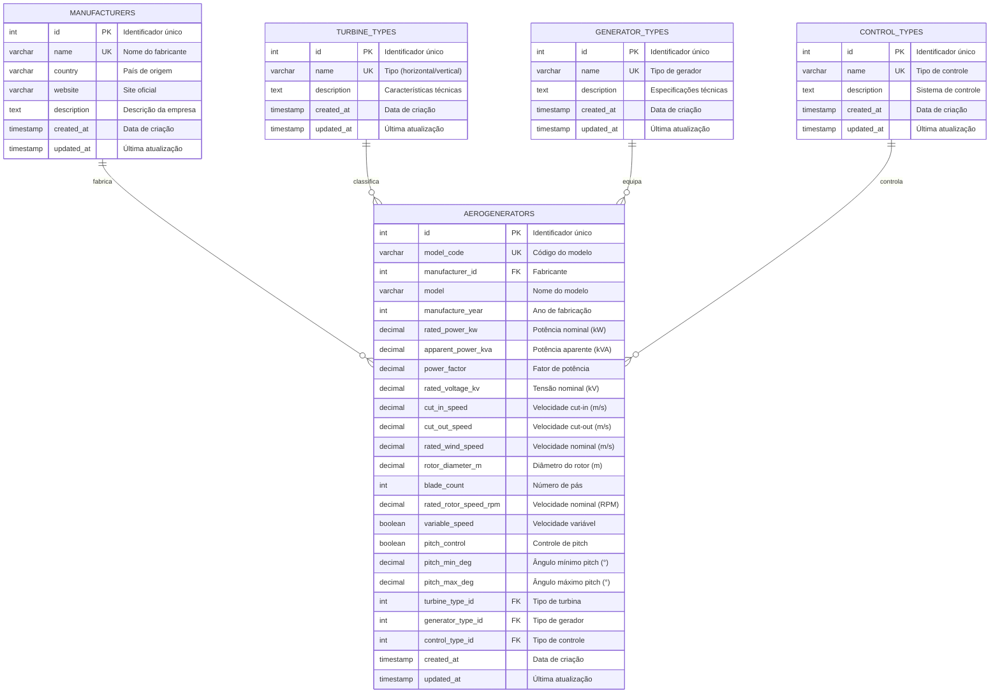

# Estrutura do Banco de Dados - Sistema EolicSim

Este documento apresenta a estrutura completa do banco de dados SQLite utilizado no sistema EolicSim, organizada em quatro domínios funcionais principais: Geográfico, Meteorológico, Parâmetros de Turbinas e Análises.

## Visão Geral da Arquitetura

O banco de dados é composto por **11 tabelas principais** organizadas em **4 domínios funcionais**:

- **Domínio Geográfico**: 3 tabelas (paises, regioes, cidades)
- **Domínio Meteorológico**: 2 tabelas (meteorological_data_source, meteorological_data)
- **Domínio de Turbinas**: 5 tabelas (manufacturers, turbine_types, generator_types, control_types, aerogenerators)
- **Domínio de Análises**: 1 tabela (sqlite_sequence - auxiliar do SQLite)

## 1. Domínio Geográfico

### 1.1 Estrutura das Tabelas

```sql
-- Tabela de Países
CREATE TABLE paises (
    id INTEGER PRIMARY KEY,
    codigo VARCHAR NOT NULL UNIQUE,
    nome VARCHAR NOT NULL UNIQUE
);

-- Tabela de Regiões/Estados
CREATE TABLE regioes (
    id INTEGER PRIMARY KEY,
    nome VARCHAR NOT NULL,
    sigla VARCHAR NOT NULL,
    pais_id INTEGER NOT NULL,
    FOREIGN KEY (pais_id) REFERENCES paises(id)
);

-- Tabela de Cidades
CREATE TABLE cidades (
    id INTEGER PRIMARY KEY,
    nome VARCHAR NOT NULL,
    latitude REAL NOT NULL,
    longitude REAL NOT NULL,
    altitude REAL,
    populacao INTEGER,
    notes TEXT,
    pais_id INTEGER NOT NULL,
    regiao_id INTEGER NOT NULL,
    FOREIGN KEY (pais_id) REFERENCES paises(id),
    FOREIGN KEY (regiao_id) REFERENCES regioes(id)
);
```

### 1.2 Fluxograma do Domínio Geográfico

```latex
\begin{tikzpicture}[
    node distance=2cm,
    every node/.style={draw, align=center, minimum width=2.5cm, minimum height=1cm}
]

% Nós das entidades
\node[fill=blue!20] (paises) at (0,0) {\textbf{PAÍSES}\\id (PK)\\codigo\\nome};
\node[fill=green!20] (regioes) at (4,0) {\textbf{REGIÕES}\\id (PK)\\nome\\sigla\\pais\_id (FK)};
\node[fill=yellow!20] (cidades) at (8,0) {\textbf{CIDADES}\\id (PK)\\nome\\latitude\\longitude\\altitude\\populacao\\notes\\pais\_id (FK)\\regiao\_id (FK)};

% Relacionamentos
\draw[->, thick] (paises) -- (regioes) node[midway, above] {1:N};
\draw[->, thick] (paises) -- (cidades) node[midway, above, sloped] {1:N};
\draw[->, thick] (regioes) -- (cidades) node[midway, above] {1:N};

\end{tikzpicture}
```

## 2. Domínio Meteorológico

### 2.1 Estrutura das Tabelas

```sql
-- Tabela de Fontes de Dados Meteorológicos
CREATE TABLE meteorological_data_source (
    id INTEGER PRIMARY KEY,
    name VARCHAR NOT NULL UNIQUE,
    description VARCHAR
);

-- Tabela de Dados Meteorológicos
CREATE TABLE meteorological_data (
    id INTEGER PRIMARY KEY,
    meteorological_data_source_id INTEGER NOT NULL,
    cidade_id INTEGER NOT NULL,
    data DATE NOT NULL,
    altura_captura REAL,
    velocidade_vento REAL,
    temperatura REAL,
    umidade REAL,
    created_at TIMESTAMP,
    FOREIGN KEY (meteorological_data_source_id) REFERENCES meteorological_data_source(id),
    FOREIGN KEY (cidade_id) REFERENCES cidades(id)
);
```

### 2.2 Fluxograma do Domínio Meteorológico

```latex
\begin{tikzpicture}[
    node distance=3cm,
    every node/.style={draw, align=center, minimum width=3cm, minimum height=1.5cm}
]

% Nós das entidades
\node[fill=orange!20] (source) at (0,0) {\textbf{METEOROLOGICAL\_DATA\_SOURCE}\\id (PK)\\name\\description};
\node[fill=red!20] (data) at (5,0) {\textbf{METEOROLOGICAL\_DATA}\\id (PK)\\meteorological\_data\_source\_id (FK)\\cidade\_id (FK)\\data\\altura\_captura\\velocidade\_vento\\temperatura\\umidade\\created\_at};
\node[fill=yellow!20] (cidades) at (10,0) {\textbf{CIDADES}\\(referência do domínio geográfico)};

% Relacionamentos
\draw[->, thick] (source) -- (data) node[midway, above] {1:N};
\draw[->, thick] (cidades) -- (data) node[midway, above] {1:N};

\end{tikzpicture}
```

## 3. Domínio de Turbinas

### 3.1 Estrutura das Tabelas

```sql
-- Tabela de Fabricantes
CREATE TABLE manufacturers (
    id INTEGER PRIMARY KEY,
    name VARCHAR NOT NULL UNIQUE,
    country VARCHAR,
    website VARCHAR,
    description TEXT,
    created_at TIMESTAMP,
    updated_at TIMESTAMP
);

-- Tabela de Tipos de Turbina
CREATE TABLE turbine_types (
    id INTEGER PRIMARY KEY,
    name VARCHAR NOT NULL UNIQUE,
    description TEXT,
    created_at TIMESTAMP,
    updated_at TIMESTAMP
);

-- Tabela de Tipos de Gerador
CREATE TABLE generator_types (
    id INTEGER PRIMARY KEY,
    name VARCHAR NOT NULL UNIQUE,
    description TEXT,
    created_at TIMESTAMP,
    updated_at TIMESTAMP
);

-- Tabela de Tipos de Controle
CREATE TABLE control_types (
    id INTEGER PRIMARY KEY,
    name VARCHAR NOT NULL UNIQUE,
    description TEXT,
    created_at TIMESTAMP,
    updated_at TIMESTAMP
);

-- Tabela de Aerogeradores (Principal)
CREATE TABLE aerogenerators (
    id INTEGER PRIMARY KEY,
    model_code VARCHAR NOT NULL UNIQUE,
    manufacturer_id INTEGER NOT NULL,
    model VARCHAR NOT NULL,
    manufacture_year INTEGER,
    rated_power_kw DECIMAL NOT NULL,
    apparent_power_kva DECIMAL,
    power_factor DECIMAL,
    rated_voltage_kv DECIMAL NOT NULL,
    cut_in_speed DECIMAL NOT NULL,
    cut_out_speed DECIMAL NOT NULL,
    rated_wind_speed DECIMAL,
    rotor_diameter_m DECIMAL NOT NULL,
    blade_count INTEGER NOT NULL,
    rated_rotor_speed_rpm DECIMAL,
    variable_speed BOOLEAN NOT NULL,
    pitch_control BOOLEAN NOT NULL,
    pitch_min_deg DECIMAL,
    pitch_max_deg DECIMAL,
    turbine_type_id INTEGER NOT NULL,
    generator_type_id INTEGER NOT NULL,
    control_type_id INTEGER NOT NULL,
    created_at TIMESTAMP,
    updated_at TIMESTAMP,
    FOREIGN KEY (manufacturer_id) REFERENCES manufacturers(id),
    FOREIGN KEY (turbine_type_id) REFERENCES turbine_types(id),
    FOREIGN KEY (generator_type_id) REFERENCES generator_types(id),
    FOREIGN KEY (control_type_id) REFERENCES control_types(id)
);
```

### 3.2 Fluxograma do Domínio de Turbinas

```latex
\begin{tikzpicture}[
    node distance=2.5cm,
    every node/.style={draw, align=center, minimum width=2.8cm, minimum height=1.2cm}
]

% Nós das entidades de referência
\node[fill=blue!20] (manufacturers) at (0,4) {\textbf{MANUFACTURERS}\\id (PK)\\name\\country\\website\\description};
\node[fill=green!20] (turbine_types) at (0,2) {\textbf{TURBINE\_TYPES}\\id (PK)\\name\\description};
\node[fill=yellow!20] (generator_types) at (0,0) {\textbf{GENERATOR\_TYPES}\\id (PK)\\name\\description};
\node[fill=orange!20] (control_types) at (0,-2) {\textbf{CONTROL\_TYPES}\\id (PK)\\name\\description};

% Entidade principal
\node[fill=red!20, minimum width=4cm, minimum height=3cm] (aerogenerators) at (6,1) {
    \textbf{AEROGENERATORS}\\
    id (PK)\\
    model\_code\\
    manufacturer\_id (FK)\\
    model\\
    manufacture\_year\\
    rated\_power\_kw\\
    apparent\_power\_kva\\
    power\_factor\\
    rated\_voltage\_kv\\
    cut\_in\_speed\\
    cut\_out\_speed\\
    rated\_wind\_speed\\
    rotor\_diameter\_m\\
    blade\_count\\
    rated\_rotor\_speed\_rpm\\
    variable\_speed\\
    pitch\_control\\
    pitch\_min\_deg\\
    pitch\_max\_deg\\
    turbine\_type\_id (FK)\\
    generator\_type\_id (FK)\\
    control\_type\_id (FK)
};

% Relacionamentos
\draw[->, thick] (manufacturers) -- (aerogenerators) node[midway, above, sloped] {1:N};
\draw[->, thick] (turbine_types) -- (aerogenerators) node[midway, above, sloped] {1:N};
\draw[->, thick] (generator_types) -- (aerogenerators) node[midway, above, sloped] {1:N};
\draw[->, thick] (control_types) -- (aerogenerators) node[midway, above, sloped] {1:N};

\end{tikzpicture}
```

## 4. Diagrama Integrado Completo

### 4.1 Todas as Relações do Sistema

```latex
\begin{tikzpicture}[
    node distance=1.5cm,
    every node/.style={draw, align=center, font=\tiny}
]

% Domínio Geográfico
\node[fill=blue!20, minimum width=2cm] (paises) at (0,8) {\textbf{PAÍSES}\\id, codigo, nome};
\node[fill=blue!20, minimum width=2cm] (regioes) at (3,8) {\textbf{REGIÕES}\\id, nome, sigla, pais\_id};
\node[fill=blue!20, minimum width=2cm] (cidades) at (6,8) {\textbf{CIDADES}\\id, nome, lat, lon\\altitude, pop, notes\\pais\_id, regiao\_id};

% Domínio Meteorológico
\node[fill=orange!20, minimum width=2.5cm] (met_source) at (0,5) {\textbf{MET\_DATA\_SOURCE}\\id, name, description};
\node[fill=orange!20, minimum width=2.5cm] (met_data) at (4,5) {\textbf{METEOROLOGICAL\_DATA}\\id, source\_id, cidade\_id\\data, altura, velocidade\\temperatura, umidade};

% Domínio de Turbinas - Tabelas de Referência
\node[fill=green!20, minimum width=2cm] (manufacturers) at (0,2) {\textbf{MANUFACTURERS}\\id, name, country\\website, description};
\node[fill=green!20, minimum width=1.8cm] (turbine_types) at (2.5,2) {\textbf{TURBINE\_TYPES}\\id, name, description};
\node[fill=green!20, minimum width=1.8cm] (generator_types) at (5,2) {\textbf{GENERATOR\_TYPES}\\id, name, description};
\node[fill=green!20, minimum width=1.8cm] (control_types) at (7.5,2) {\textbf{CONTROL\_TYPES}\\id, name, description};

% Domínio de Turbinas - Entidade Principal
\node[fill=red!20, minimum width=4cm, minimum height=2cm] (aerogenerators) at (4,0) {
    \textbf{AEROGENERATORS}\\
    id, model\_code, manufacturer\_id\\
    model, manufacture\_year\\
    rated\_power\_kw, apparent\_power\_kva\\
    power\_factor, rated\_voltage\_kv\\
    cut\_in\_speed, cut\_out\_speed\\
    rated\_wind\_speed, rotor\_diameter\_m\\
    blade\_count, rated\_rotor\_speed\_rpm\\
    variable\_speed, pitch\_control\\
    pitch\_min\_deg, pitch\_max\_deg\\
    turbine\_type\_id, generator\_type\_id\\
    control\_type\_id
};

% Relacionamentos Geográficos
\draw[->, thick, blue] (paises) -- (regioes);
\draw[->, thick, blue] (paises) -- (cidades);
\draw[->, thick, blue] (regioes) -- (cidades);

% Relacionamentos Meteorológicos
\draw[->, thick, orange] (met_source) -- (met_data);
\draw[->, thick, orange] (cidades) -- (met_data);

% Relacionamentos de Turbinas
\draw[->, thick, green] (manufacturers) -- (aerogenerators);
\draw[->, thick, green] (turbine_types) -- (aerogenerators);
\draw[->, thick, green] (generator_types) -- (aerogenerators);
\draw[->, thick, green] (control_types) -- (aerogenerators);

% Legenda
\node[draw=none, align=left] at (10,6) {
    \textbf{Legenda:}\\
    \textcolor{blue}{■ Domínio Geográfico}\\
    \textcolor{orange}{■ Domínio Meteorológico}\\
    \textcolor{green}{■ Domínio de Turbinas}\\
    \textcolor{red}{■ Entidade Principal}
};

\end{tikzpicture}
```

## 5. Resumo das Relações

### 5.1 Chaves Estrangeiras

| Tabela Filha | Campo | Tabela Pai | Propósito |
|--------------|-------|------------|-----------|
| regioes | pais_id | paises | Hierarquia geográfica |
| cidades | pais_id | paises | Localização por país |
| cidades | regiao_id | regioes | Localização por região |
| meteorological_data | cidade_id | cidades | Dados por localização |
| meteorological_data | meteorological_data_source_id | meteorological_data_source | Origem dos dados |
| aerogenerators | manufacturer_id | manufacturers | Fabricante do equipamento |
| aerogenerators | turbine_type_id | turbine_types | Tipo de turbina |
| aerogenerators | generator_type_id | generator_types | Tipo de gerador |
| aerogenerators | control_type_id | control_types | Tipo de controle |

### 5.2 Cardinalidades

- **Um para Muitos (1:N)**: Todas as relações do sistema seguem este padrão
- **Integridade Referencial**: Garantida através de chaves estrangeiras
- **Normalização**: Terceira Forma Normal (3FN) aplicada

## 6. Considerações Técnicas

### 6.1 Índices Recomendados
```sql
-- Índices para otimização de consultas
CREATE INDEX idx_regioes_pais_id ON regioes(pais_id);
CREATE INDEX idx_cidades_pais_id ON cidades(pais_id);
CREATE INDEX idx_cidades_regiao_id ON cidades(regiao_id);
CREATE INDEX idx_met_data_cidade_id ON meteorological_data(cidade_id);
CREATE INDEX idx_met_data_source_id ON meteorological_data(meteorological_data_source_id);
CREATE INDEX idx_aerogen_manufacturer ON aerogenerators(manufacturer_id);
CREATE INDEX idx_aerogen_turbine_type ON aerogenerators(turbine_type_id);
CREATE INDEX idx_aerogen_generator_type ON aerogenerators(generator_type_id);
CREATE INDEX idx_aerogen_control_type ON aerogenerators(control_type_id);
```

### 6.2 Características da Implementação
- **SGBD**: SQLite 3.x (serverless, embedded)
- **Encoding**: UTF-8 para suporte internacional
- **Constraints**: Chaves primárias auto-incrementais
- **Timestamps**: Formato ISO 8601
- **Decimais**: Precisão para cálculos científicos

## 7. Diagramas Mermaid

### 7.1 Diagrama Completo do Sistema


### 7.2 Diagrama do Domínio Geográfico


### 7.3 Diagrama do Domínio Meteorológico


### 7.4 Diagrama do Domínio de Turbinas



### 7.5 Fluxo de Dados Integrado


---

**Nota**: Esta documentação reflete a estrutura real do banco de dados verificada através do script `check_db.py`. Os diagramas LaTeX podem ser renderizados em editores compatíveis com TikZ/PGF, e os diagramas Mermaid podem ser visualizados em plataformas que suportam esta sintaxe (GitHub, GitLab, Notion, etc.).