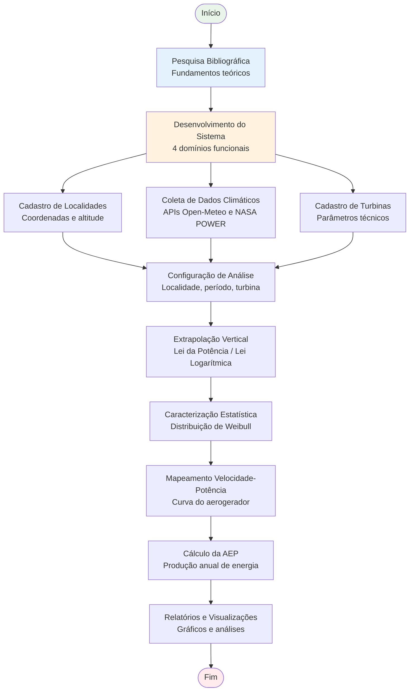

```mermaid
flowchart TD
    Start([Início]) --> A[Pesquisa Bibliográfica<br/>Fundamentos teóricos]
    A --> B[Desenvolvimento do Sistema<br/>4 domínios funcionais]
    
    B --> C[Cadastro de Localidades<br/>Coordenadas e altitude]
    B --> D[Coleta de Dados Climáticos<br/>APIs Open-Meteo e NASA POWER]
    B --> E[Cadastro de Turbinas<br/>Parâmetros técnicos]
    
    C --> F[Configuração de Análise<br/>Localidade, período, turbina]
    D --> F
    E --> F
    
    F --> G[Extrapolação Vertical<br/>Lei da Potência / Lei Logarítmica]
    G --> H[Caracterização Estatística<br/>Distribuição de Weibull]
    H --> I[Mapeamento Velocidade-Potência<br/>Curva do aerogerador]
    I --> J[Cálculo da AEP<br/>Produção anual de energia]
    J --> K[Relatórios e Visualizações<br/>Gráficos e análises]
    K --> End([Fim])
    
    
    style Start fill:#e8f5e8
    style A fill:#e3f2fd
    style B fill:#fff3e0
    style End fill:#ffebee
```