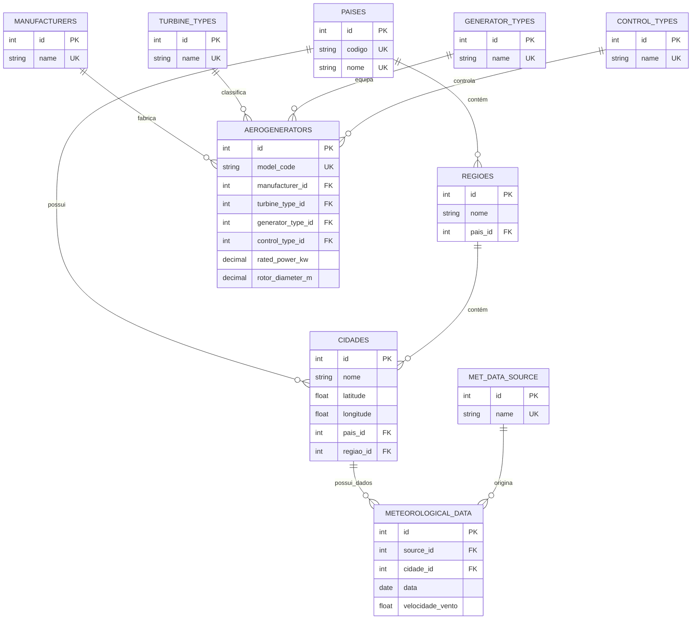
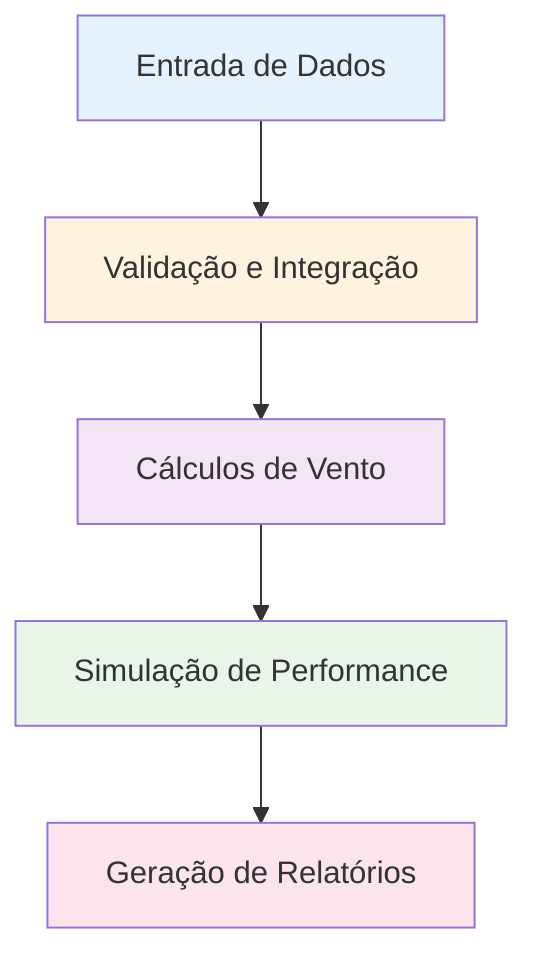
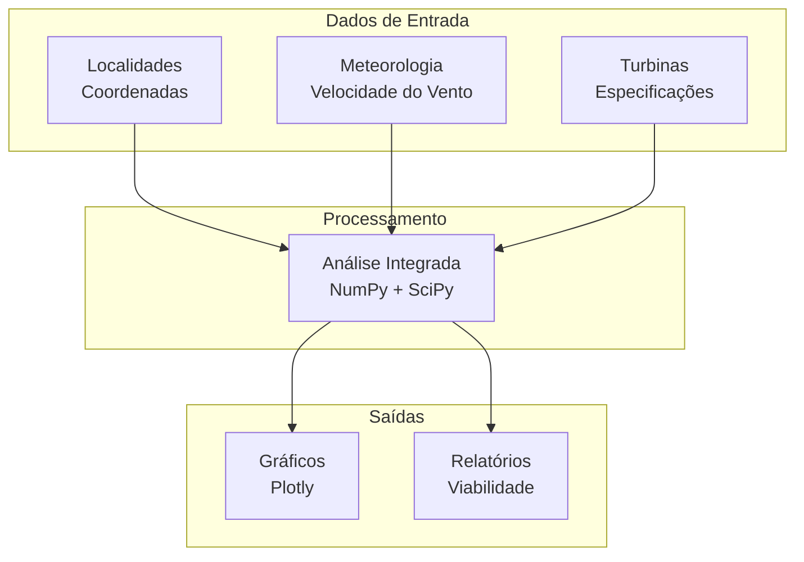

# SISTEMA DE GERAÇÃO EÓLICA - EOLICSIM

## RESUMO

Este documento apresenta as principais tecnologias adotadas no desenvolvimento do sistema EolicSim, justificando cada escolha técnica com base em critérios de eficiência, facilidade de implementação e adequação ao escopo de análise de potencial eólico. A arquitetura tecnológica empregada prioriza a integração entre coleta de dados climáticos, modelagem de turbinas e estimativa de geração eólica.

## TECNOLOGIAS ADOTADAS NO SISTEMA EOLICSIM

O EolicSim — Simulador de Potência Eólica constitui uma plataforma computacional voltada à estimativa do potencial eólico de um local e da potência gerada por turbinas eólicas. O sistema integra funcionalidades de análise, modelagem e simulação estatística para organizar informações de locais, dados climáticos e turbinas, viabilizando estimativas de desempenho em nível conceitual e coerente com estudos de geração eólica.

O desenvolvimento do sistema estrutura-se em quatro domínios funcionais que articulam o fluxo de análise, conforme ilustrado na figura de organização das páginas. O primeiro domínio contempla o cadastro e a gestão de locais de estudo, permitindo registrar e manter informações geográficas essenciais para a contextualização das análises. O segundo domínio abrange o registro e a organização de dados climáticos, com associação a locais e períodos de referência, possibilitando caracterizações descritivas do regime de ventos em nível conceitual. O terceiro domínio trata do cadastro e da caracterização de turbinas eólicas, com organização de parâmetros técnicos essenciais, como fabricante, tipo de turbina, tipo de gerador, tipos de controle e parâmetros de geração. Por fim, o quarto domínio integra os anteriores ao estimar, de forma conceitual, o potencial de geração de uma turbina associada a um local com dados climáticos registrados.

Essa organização favorece a rastreabilidade das análises, desde o registro do local até a seleção da turbina e a obtenção de estimativas de geração, preservando a clareza dos passos e a consistência entre as informações utilizadas.

### INTRODUÇÃO

A implementação dos quatro domínios funcionais do EolicSim demandou a seleção criteriosa de tecnologias que atendessem aos requisitos específicos de cada módulo: desde a gestão de informações geográficas até a simulação de performance de turbinas eólicas. A arquitetura tecnológica adotada baseia-se em Python como linguagem principal, Streamlit para interface web interativa e SQLite como sistema de persistência, complementada por bibliotecas especializadas em análise científica e integração com APIs meteorológicas externas.

As escolhas tecnológicas foram orientadas pela necessidade de integração eficiente entre os domínios funcionais, garantindo fluxo consistente de dados desde o cadastro de localidades até a estimativa final de geração eólica. ~~Esta seção apresenta as justificativas técnicas para cada tecnologia selecionada, considerando sua adequação aos requisitos de análise energética e facilidade de implementação no contexto acadêmico.~~

### LINGUAGEM DE PROGRAMAÇÃO

#### Python 3.x

A linguagem Python foi selecionada como base tecnológica principal devido à sua consolidação no desenvolvimento de aplicações científicas e análise de dados energéticos. Python oferece sintaxe clara e expressiva que facilita a implementação de algoritmos complexos de modelagem eólica, além de possuir um ecossistema robusto de bibliotecas especializadas em computação numérica e análise meteorológica.

A escolha justifica-se pela necessidade de integração eficiente entre diferentes fontes de dados climáticos, processamento matemático de parâmetros de turbinas e geração de interfaces interativas. Python permite prototipagem rápida e desenvolvimento iterativo, características essenciais para sistemas que demandam validação constante de modelos energéticos. Adicionalmente, sua natureza interpretada facilita a manutenção e extensão do código, aspecto fundamental para projetos acadêmicos de longo prazo.

### INTERFACE

#### Streamlit

O framework Streamlit foi adotado para desenvolvimento da interface web interativa do EolicSim, representando uma escolha estratégica para aplicações de análise energética. Streamlit permite a criação de aplicações web usando exclusivamente Python, eliminando a necessidade de conhecimentos em tecnologias web tradicionais como HTML, CSS ou JavaScript.

A principal justificativa para esta escolha reside na integração nativa com bibliotecas científicas Python, possibilitando visualização interativa de dados meteorológicos e resultados de simulações em tempo real. Esta característica é fundamental para sistemas de análise eólica que requerem feedback visual imediato durante a configuração de cenários e avaliação de resultados. O Streamlit oferece ainda deployment simplificado e interface responsiva, adequada para usuários técnicos e não técnicos que utilizam o sistema para estimativas de potencial eólico.

### BANCO DE DADOS

#### SQLite

O SQLite foi selecionado como sistema de gerenciamento de banco de dados principal do EolicSim, constituindo uma escolha tecnicamente fundamentada para o contexto de análise de dados meteorológicos e parâmetros de turbinas eólicas. SQLite é um  sistema de gerenciamento de banco de dados (SGBD) relacional serverless que armazena toda a base de dados em um único arquivo, eliminando dependências de instalação e configuração de servidores externos.

Para aplicações de estimativa de potencial eólico, o SQLite oferece desempenho adequado para volumes típicos de dados meteorológicos históricos e cadastros de turbinas, mantendo compatibilidade total com SQL padrão. Sua arquitetura self-contained facilita significativamente a distribuição e portabilidade do sistema, aspectos essenciais para ferramentas acadêmicas e de pesquisa.

### PRINCIPAIS BIBLIOTECAS

#### APIs de Dados Climáticos
```latex
\section{Principais Bibliotecas e APIs}

Durante o desenvolvimento do sistema, algumas bibliotecas se destacaram por sua relevância na integração de dados meteorológicos, análise científica e visualização dos resultados. A seguir, são apresentadas as principais APIs e bibliotecas utilizadas no EolicSim, com suas respectivas justificativas técnicas:

\begin{itemize}
    \item \textbf{APIs de Dados Climáticos}
    \begin{itemize}
        \item \textbf{Open-Meteo API}: Fonte primária de dados meteorológicos históricos, acesso gratuito, cobertura global, dados de velocidade do vento na altura de 10 metros, essenciais para análise de perfis eólicos no contexto do sistema.
        \item \textbf{NASA POWER API}: Fonte complementar baseada em medições satelitais, histórico extenso de dados de vento na altura de 10 metros, utilizada para validação e comparação entre fontes de dados.
    \end{itemize}
    \item \textbf{Bibliotecas de Análise Científica}
    \begin{itemize}
        \item \textbf{NumPy}: Base para computação científica, operações matriciais e algoritmos de perfil de vento (Lei de Potência, Lei Logarítmica).
        \item \textbf{Pandas}: Manipulação de séries temporais meteorológicas, análise estatística e processamento de dados históricos de vento.
        \item \textbf{Plotly}: Visualização interativa de dados meteorológicos e simulações, gráficos compatíveis com Streamlit (curvas de potência, rosas dos ventos, análises temporais).
    \end{itemize}
\end{itemize}
```

 
#### Modelagem do Banco de Dados

A modelagem do banco de dados do sistema EolicSim implementa uma arquitetura relacional normalizada que organiza as informações em **11 tabelas principais** distribuídas através de **4 domínios funcionais**. A estrutura prioriza a integridade referencial e a eliminação de redundâncias através de relacionamentos bem definidos entre as entidades.

**Organização por Domínios Funcionais**

O sistema estrutura-se em quatro domínios interconectados: **Geográfico** (3 tabelas), **Meteorológico** (2 tabelas), **Turbinas** (5 tabelas) e **Análises** (1 tabela auxiliar). Cada domínio implementa relacionamentos específicos que garantem consistência e rastreabilidade das informações.

**Relacionamentos e Integridade Referencial**

O modelo implementa relacionamentos 1:N (um para muitos) através de chaves estrangeiras que conectam os domínios funcionais. A hierarquia geográfica estabelece a base locacional, os dados meteorológicos associam-se às localidades, e as especificações de turbinas organizam-se através de entidades de referência que convergem na entidade principal `aerogenerators`.



**Principais Relacionamentos do Sistema**

1. **Hierarquia Geográfica**: `paises` → `regioes` → `cidades` estabelece a contextualização geográfica
2. **Dados Meteorológicos**: `cidades` ← `meteorological_data` → `meteorological_data_source` conecta localização e clima
3. **Especificações de Turbinas**: Quatro entidades de referência convergem em `aerogenerators` para caracterização completa
4. **Integração Analítica**: Todos os domínios convergem para suportar análises de viabilidade eólica

**Padrão Repository e Abstração**

A implementação utiliza o padrão Repository para abstração da camada de persistência, com repositórios especializados para cada domínio que encapsulam operações CRUD e consultas relacionais complexas. Esta abordagem facilita manutenção, permite testes unitários abrangentes e garante separação clara entre lógica de negócio e persistência de dados.

Em síntese, a modelagem prioriza relacionamentos claros entre domínios funcionais, integridade referencial robusta e normalização adequada para suporte eficiente às análises de potencial eólico, mantendo simplicidade estrutural sem comprometer funcionalidade técnica.


## ARQUITETURA E DOMÍNIOS FUNCIONAIS

A arquitetura do sistema EolicSim fundamenta-se em uma abordagem modular que organiza as funcionalidades em quatro domínios funcionais interconectados. Esta estruturação estabelece um fluxo lógico e sequencial de análise, onde cada domínio contribui com informações específicas que, integradas, viabilizam a estimativa do potencial de geração eólica de uma localidade. A organização modular facilita a manutenção e escalabilidade do sistema, proporcionando clareza na compreensão do processo analítico desde a caracterização geográfica inicial até a estimativa final de performance energética.

### Domínio 1: Localidades

O domínio Localidades constitui o alicerce geográfico do sistema de análise. Este módulo implementa uma estrutura hierárquica organizada em três níveis interdependentes: países, regiões (estados) e cidades, conforme ilustrado na Figura 1 - Hierarquia e Estrutura Geográfica do Sistema EolicSim. A organização hierárquica fundamenta-se na necessidade de estabelecer contexto geográfico preciso para as análises subsequentes, uma vez que características topográficas, climáticas e regulatórias variam significativamente entre diferentes regiões.

A implementação tecnológica utiliza a biblioteca GeoPy para processamento de coordenadas geográficas e cálculos de distância haversine, garantindo precisão nas validações de posicionamento e nas funcionalidades de busca por proximidade. O sistema implementa validações rigorosas de coordenadas geográficas, assegurando que as latitudes permaneçam no intervalo [-90°, 90°] e as longitudes no intervalo [-180°, 180°], conforme padrões cartográficos internacionais.

A interface do usuário, desenvolvida em Streamlit, apresenta formulários intuitivos para cadastro de localidades e integra funcionalidades de visualização cartográfica em tempo real, permitindo verificação imediata da precisão dos dados inseridos. Adicionalmente, a estrutura do banco de dados SQLite implementa índices compostos otimizados para consultas geográficas, utilizando combinações de latitude e longitude para acelerar operações de busca espacial, conforme demonstrado na Figura 2 - Modelo de Dados e Índices Geográficos.

Por conseguinte, este conjunto de decisões tecnológicas contribui para a confiabilidade do sistema ao garantir precisão geográfica e consistência referencial entre as entidades, fundamentais para análises de viabilidade eólica que consideram características topográficas regionais.

### Domínio 2: Dados Climáticos

O domínio Dados Climáticos estabelece a base meteorológica para análise de potencial eólico através da integração com múltiplas fontes de dados e implementação de ferramentas de análise estatística. A transição natural do domínio anterior ocorre através da associação entre localidades cadastradas e informações meteorológicas correspondentes, representando o núcleo informacional do sistema.

A arquitetura tecnológica integra duas fontes primárias de dados meteorológicos. A API Open-Meteo fornece dados de reanálise meteorológica com cobertura global e resolução temporal horária, suportando coleta de dados de velocidade do vento. A API NASA POWER disponibiliza dados satelitais validados com histórico extenso de décadas, constituindo fonte alternativa para validação e comparação.

O processamento de dados meteorológicos emprega a biblioteca Pandas com otimizações para séries temporais, permitindo manipulação eficiente de grandes volumes de dados históricos e geração de agregações estatísticas necessárias para caracterização do regime de ventos local. Além disso, o sistema implementa funcionalidades de análise de viabilidade eólica, incluindo classificação automática de condições de vento segundo a escala Beaufort e aplicação de correções de velocidade por altura utilizando a Lei de Potência.

A Figura 3 - Fluxo de Coleta e Processamento de Dados Meteorológicos ilustra o processo completo desde a requisição às APIs externas até o armazenamento final no banco de dados SQLite. O sistema incorpora cache automático e retry para APIs externas, garantindo robustez na coleta de dados e reduzindo dependência de conectividade externa.


```latex
\begin{figure}[H]
    \centering
    % Estilos TikZ
    \tikzstyle{startstop} = [rectangle, rounded corners, 
    minimum width=2cm, 
    minimum height=0.7cm,
    text centered, 
    draw=black, 
    fill=blue!20]

    \tikzstyle{io} = [trapezium, 
    trapezium stretches=true,
    trapezium left angle=70, 
    trapezium right angle=110, 
    minimum width=2cm, 
    minimum height=0.7cm, text centered, 
    draw=black, fill=green!20]

    \tikzstyle{process} = [rectangle, 
    minimum width=2.2cm, 
    minimum height=0.7cm, 
    text centered, 
    text width=2cm, 
    draw=black, 
    fill=orange!20]

    \tikzstyle{decision} = [diamond, 
    minimum width=1.8cm, 
    minimum height=0.8cm, 
    text centered, 
    text width=1.6cm,
    draw=black, 
    fill=yellow!20]

    \tikzstyle{database} = [cylinder, 
    minimum width=1.8cm, 
    minimum height=0.8cm, 
    text centered, 
    draw=black, 
    fill=purple!20]

    \tikzstyle{arrow} = [thick,->,>=stealth]

    \begin{tikzpicture}[node distance=1.6cm]
        \node (start) [startstop] {Início};
        \node (input) [io, below of=start] {Seleção Parâmetros};
        \node (validate) [process, below of=input] {Validação};
        \node (api_choice) [decision, below of=validate] {Escolha API};
        \node (nasa) [process, left of=api_choice, xshift=-2cm] {NASA POWER};
        \node (openmeteo) [process, right of=api_choice, xshift=2cm] {Open-Meteo};
        \node (processing) [process, below of=api_choice] {Processamento Pandas};
        \node (analysis) [process, below of=processing] {Análise Beaufort};
        \node (storage) [database, below of=analysis] {SQLite};
        \node (end) [startstop, below of=storage] {Dados Prontos};

        % Conexões
        \draw [arrow] (start) -- (input);
        \draw [arrow] (input) -- (validate);
        \draw [arrow] (validate) -- (api_choice);
        \draw [arrow] (api_choice) -- node[anchor=south] {NASA} (nasa);
        \draw [arrow] (api_choice) -- node[anchor=south] {Open-Meteo} (openmeteo);
        \draw [arrow] (nasa) |- (processing);
        \draw [arrow] (openmeteo) |- (processing);
        \draw [arrow] (processing) -- (analysis);
        \draw [arrow] (analysis) -- (storage);
        \draw [arrow] (storage) -- (end);
    \end{tikzpicture}
    \caption{Fluxograma do processo de coleta, validação e armazenamento de dados meteorológicos no EolicSim.}
    \label{fig:fluxo-meteorologico}
\end{figure}
```


Em síntese, a integração com múltiplas APIs meteorológicas garante disponibilidade e qualidade dos dados, enquanto o processamento vectorizado permite análise eficiente de grandes volumes de dados históricos, contribuindo para a rastreabilidade e confiabilidade das estimativas eólicas.

### Domínio 3: Turbinas

O domínio Turbinas estabelece a ponte tecnológica entre as condições ambientais caracterizadas e os equipamentos de geração eólica disponíveis para instalação. Este módulo implementa um modelo de dados complexo que organiza informações técnicas através de cinco entidades inter-relacionadas: fabricantes, tipos de turbina, tipos de gerador, tipos de controle e aerogeradores completos.

A arquitetura de dados utiliza o padrão Repository para abstração da camada de persistência, facilitando operações de manutenção e permitindo implementação de testes unitários. O modelo relacional implementa restrições de integridade referencial através de foreign keys e constraints personalizados, garantindo consistência entre componentes e validando dependências funcionais entre diferentes tipos de equipamentos.

O cadastro de aerogeradores incorpora mais de 25 parâmetros técnicos, incluindo: curva de potência, velocidades de cut-in e cut-out, eficiências nominais, especificações do rotor, características da nacele e parâmetros de controle operacional. A interface implementa formulários dinâmicos que se adaptam automaticamente ao tipo de turbina selecionado, apresentando campos específicos e validações personalizadas para cada categoria de equipamento.

Adicionalmente, o sistema incorpora algoritmos de validação técnica que verificam a consistência física dos parâmetros inseridos, detectando automaticamente inconsistências como velocidades de cut-out menores que velocidades de cut-in ou potências nominais incompatíveis com diâmetros de rotor especificados. A Figura 4 - Modelo Relacional e Validações do Domínio de Turbinas apresenta a estrutura completa das entidades e seus relacionamentos.

Por conseguinte, o modelo relacional normalizado evita redundância de dados e facilita atualizações de informações técnicas, enquanto as validações implementadas garantem consistência física dos parâmetros, aspectos essenciais para precisão das simulações energéticas.

### Domínio 4: Análise e Simulação

O domínio Análise e Simulação representa a síntese integrativa de todos os domínios anteriores, implementando modelos matemáticos e algoritmos de simulação que convergem para a estimativa final do potencial de geração eólica. Este domínio constitui o núcleo analítico do sistema, onde informações de localização geográfica, dados climáticos históricos e especificações técnicas de turbinas são processados através de algoritmos cientificamente fundamentados.

A implementação tecnológica utiliza NumPy para computação científica de alta performance, possibilitando processamento vectorizado de grandes conjuntos de dados e implementação eficiente de algoritmos de perfil de vento baseados na Lei de Potência e Lei Logarítmica. A biblioteca SciPy complementa as funcionalidades através de algoritmos para cálculo do coeficiente de performance (Cp) de turbinas eólicas e simulação de componentes do vento, incluindo vento médio, ondas e turbulência.

O módulo de visualização emprega Plotly para geração de gráficos interativos que incluem: curva de potência de turbinas, rosas dos ventos multidirecionais, análises temporais de produção energética e comparações de performance entre diferentes modelos de equipamentos. O processo analítico estrutura-se em cinco etapas sequenciais: configuração de parâmetros iniciais com seleção integrada de localidade, turbina e período de análise; cálculo de perfis verticais de vento com aplicação de correções por rugosidade superficial e presença de obstáculos; simulação detalhada de componentes de vento considerando variações temporais e espaciais; estimativa de performance de turbina através de modelos matemáticos validados; geração de relatórios visuais incluindo recomendações técnicas para viabilidade econômica do projeto.

A Figura 5 - Fluxo Analítico e Modelos de Simulação do EolicSim demonstra a integração sequencial entre todos os módulos do sistema, evidenciando como informações de cada domínio convergem para a estimativa final de geração.



**Figura 5 - Fluxo Analítico e Modelos de Simulação do EolicSim**

Para compreender melhor como o sistema processa as informações, é útil visualizar o fluxo através de uma perspectiva de convergência de dados, onde três fontes distintas de informação se unem para produzir resultados práticos. Imagine o sistema como uma fábrica que recebe três tipos de matéria-prima diferentes e as transforma em produtos finais úteis.

**Etapa de Dados de Entrada**

O processo inicia com três tipos fundamentais de informação que alimentam o sistema. Primeiro, temos as **Localidades com suas Coordenadas**, que funcionam como o "endereço" onde queremos instalar a turbina eólica. Assim como você precisa saber o endereço exato para entregar uma encomenda, o sistema precisa conhecer a localização precisa (latitude e longitude) para realizar cálculos corretos. Essas coordenadas não são apenas números - elas carregam informações sobre altitude, características do terreno e outros fatores geográficos que influenciam o comportamento do vento.

O segundo tipo de entrada são os **Dados Meteorológicos**, especificamente a velocidade do vento ao longo do tempo. Pense nisso como um histórico detalhado do "comportamento do vento" naquele local específico - é como ter um diário que registra, dia após dia, mês após mês, como o vento soprou naquela região. Esses dados incluem não apenas a velocidade, mas também informações sobre direção, variações sazonais e padrões climáticos que se repetem ao longo dos anos.

O terceiro componente são as **Especificações das Turbinas**, que representam as "características técnicas" do equipamento que queremos instalar. Imagine isso como a ficha técnica completa de um carro - ela informa qual é a potência máxima, em que condições o equipamento funciona melhor, quando ele para de funcionar (por segurança), e todas as suas limitações e capacidades.

**Etapa de Processamento**

No centro do sistema acontece a **Análise Integrada**, onde as bibliotecas científicas NumPy e SciPy atuam como "calculadoras superinteligentes" que processam enormes quantidades de dados simultaneamente. Esta etapa é como ter um engenheiro experiente que pega todas as informações disponíveis e aplica fórmulas matemáticas complexas para entender como o vento se comportará na altura da turbina (que geralmente é muito mais alta que onde os dados foram medidos) e como a turbina específica escolhida reagirá a essas condições de vento.

Durante este processamento, o sistema considera fatores como: a rugosidade do terreno (se há árvores, prédios ou outras obstruções), a altura onde a turbina será instalada (o vento é mais forte quanto mais alto você vai), e as características específicas da turbina escolhida (cada modelo tem sua própria "personalidade" e reage de forma diferente às mesmas condições de vento).

**Etapa de Saídas**

Finalmente, o sistema produz dois tipos de resultados práticos. Os **Gráficos criados com Plotly** são representações visuais que transformam números complexos em imagens fáceis de entender. É como transformar uma planilha gigante de números em gráficos coloridos que mostram, por exemplo, "em que meses do ano a turbina produzirá mais energia" ou "qual é a relação entre velocidade do vento e energia gerada". Esses gráficos permitem que mesmo pessoas sem formação técnica compreendam rapidamente o potencial de geração do local.

O segundo tipo de saída são os **Relatórios de Viabilidade**, que funcionam como um "parecer técnico" completo. Estes relatórios não apenas apresentam números, mas traduzem os resultados em recomendações práticas: "Este local é adequado para instalação de turbinas eólicas?", "Qual seria a produção estimada de energia?", "O investimento seria economicamente viável?". É como ter um consultor especializado que analisa todos os dados e fornece conselhos claros sobre a decisão de investimento.

Essa organização em "funil de convergência" evidencia como informações aparentemente desconectadas (um endereço, dados climáticos e especificações técnicas) se transformam, através de processamento científico rigoroso, em informações práticas e acionáveis para tomada de decisões sobre investimentos em energia eólica.

Além disso, a integração de bibliotecas científicas garante precisão matemática dos modelos implementados, enquanto a visualização interativa facilita interpretação de resultados complexos, contribuindo significativamente para o desempenho e confiabilidade das estimativas de potencial eólico.




### Integração Arquitetural

A integração entre os quatro domínios funcionais constitui aspecto crítico da arquitetura do EolicSim, viabilizada através da implementação de interfaces padronizadas e validações cruzadas que asseguram consistência informacional em todo o fluxo analítico. O sistema utiliza o banco de dados SQLite como camada de persistência comum a todos os módulos, implementando transações que garantem integridade referencial entre dados de diferentes domínios.

A padronização de interfaces através do padrão Repository facilita a comunicação entre módulos e permite implementação de validações cruzadas que verificam, por exemplo, a compatibilidade entre condições climáticas locais e especificações operacionais de turbinas selecionadas. Esta arquitetura integrada resulta em um sistema coeso que mantém rastreabilidade completa e auditável desde o cadastro inicial de localidades até a geração final de estimativas de potencial eólico.

A Figura 6 - Arquitetura Integrada e Fluxo de Dados entre Domínios ilustra como a comunicação entre módulos preserva a consistência dos dados e garante a qualidade das análises. Por conseguinte, esta abordagem arquitetural contribui para a confiabilidade do sistema ao estabelecer controles rigorosos de qualidade e rastreabilidade em todas as etapas do processo analítico.

Em síntese, a arquitetura modular do EolicSim demonstra como a organização sistemática de funcionalidades em domínios especializados, combinada com tecnologias adequadas e validações rigorosas, resulta em uma plataforma robusta e confiável para estimativa de potencial eólico, atendendo aos requisitos de precisão técnica e usabilidade necessários para aplicações acadêmicas e profissionais na área de energia renovável.
