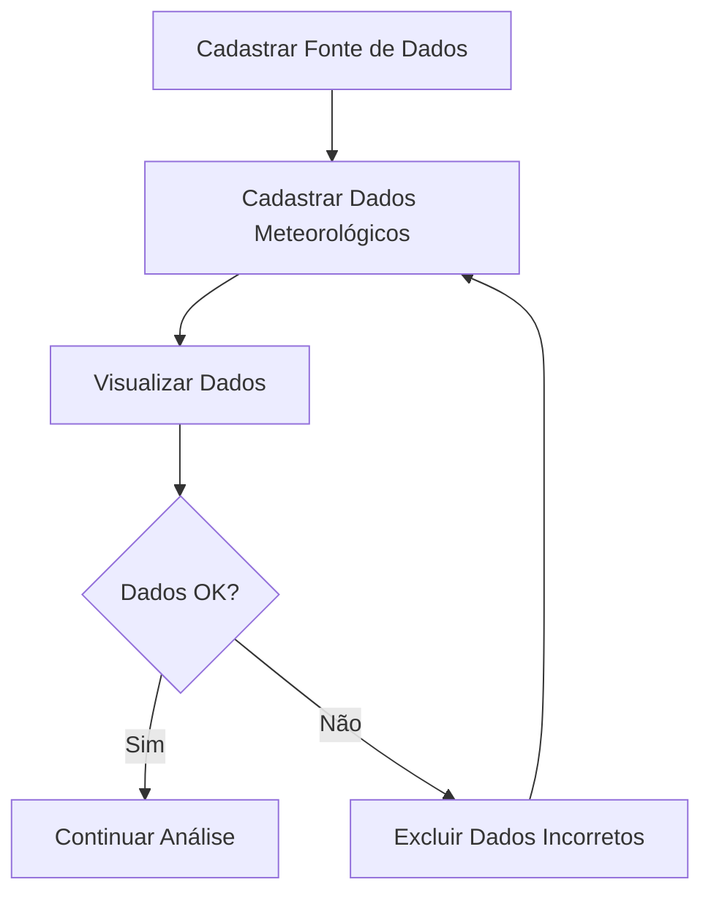

# Módulo de Registro Meteorológico - Subpáginas

Este diretório contém as subpáginas do módulo de registro meteorológico, oferecendo funcionalidades completas para gerenciamento de dados climáticos.

## Estrutura das Subpáginas

### 1. `create_meteorological_data_source.py`
**Funcionalidade:** Cadastro de Fontes de Dados
- Registro de novas APIs e fontes de dados meteorológicos
- Configuração de parâmetros das fontes
- Gerenciamento de credenciais e endpoints

### 2. `create_meteorological_data.py`  
**Funcionalidade:** Cadastro de Dados Meteorológicos
- Coleta de dados das APIs (NASA POWER, Open-Meteo)
- Processamento e validação dos dados
- Armazenamento no banco de dados
- Prevenção de duplicatas

### 3. `view_meteorological_data.py` ✨ **NOVO**
**Funcionalidade:** Visualização de Dados
- Consulta interativa dos dados coletados
- Filtros por cidade, período, altura e fonte
- Estatísticas e métricas em tempo real
- Export para CSV

### 4. `delete_meteorological_data.py` ✨ **NOVO**
**Funcionalidade:** Exclusão de Dados
- Remoção seletiva por período
- Exclusão completa por cidade
- Sistema de confirmações de segurança
- Relatórios de exclusão

## Fluxo de Uso Recomendado

## Integração

Todas as subpáginas são integradas através do arquivo principal `3_meteorological_registration.py`, que fornece:

- Interface unificada com navegação por abas
- Gestão de estado da sessão
- Tratamento centralizado de erros
- Informações contextuais na sidebar

## Dependências

### Repositórios Utilizados:
- `MeteorologicalDataRepository`
- `MeteorologicalDataSourceRepository` 
- `CidadeRepository`
- `RegiaoRepository`
- `PaisRepository`

### APIs Integradas:
- NASA POWER API
- Open-Meteo API

### Bibliotecas:
- `streamlit` - Interface web
- `pandas` - Manipulação de dados
- `sqlite3` - Banco de dados
- `datetime` - Manipulação de datas

## Padrões Seguidos

### Arquitetura:
- **Repository Pattern** para acesso a dados
- **Separation of Concerns** entre UI e lógica
- **Modular Design** com subpáginas independentes

### Interface:
- **Consistent Styling** usando CSS customizado
- **Responsive Design** com colunas adaptáveis
- **User Experience** com feedback e validações

### Código:
- **Type Hints** para melhor documentação
- **Error Handling** robusto
- **Docstrings** detalhadas
- **Clean Code** principles

## Configuração CSS

As páginas utilizam classes CSS personalizadas:
- `.section-header` - Cabeçalhos de seção
- `.page-main-header` - Cabeçalho principal
- `.info-box` - Caixas informativas
- Estilos responsivos e consistentes

## Contribuição

Ao adicionar novas funcionalidades:

1. **Siga o padrão** das subpáginas existentes
2. **Atualize o `__init__.py`** com novos imports
3. **Modifique a página principal** para incluir navegação
4. **Documente** adequadamente as mudanças
5. **Teste** todas as integrações

---

**Desenvolvido seguindo os padrões estabelecidos no projeto Wind Turbine Modeling** 🌪️
